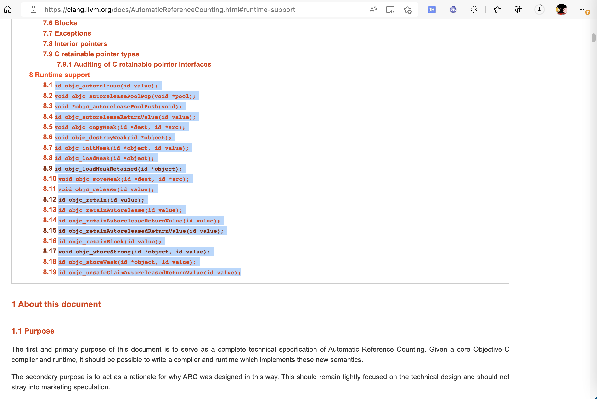

# objc系列函数

此处介绍iOS的ObjC的Runtime中，常见的，以`objc`开头的一些系列函数。

其中对应官网资料就是：

* [Objective-C Automatic Reference Counting (ARC) — Clang 15.0.0git documentation (llvm.org)](https://clang.llvm.org/docs/AutomaticReferenceCounting.html#arc-runtime-objc-retain)

对应的`objc`开头的系列函数是：

* id `objc_autorelease`(id value);
* void `objc_autoreleasePoolPop`(void *pool);
* void *`objc_autoreleasePoolPush`(void);
* id `objc_autoreleaseReturnValue`(id value);
* void `objc_copyWeak`(id *dest, id *src);
* void `objc_destroyWeak`(id *object);
* id `objc_initWeak`(id *object, id value);
* id `objc_loadWeak`(id *object);
* id `objc_loadWeakRetained`(id *object);
* void `objc_moveWeak`(id *dest, id *src);
* void `objc_release`(id value);
* id `objc_retain`(id value);
* id `objc_retainAutorelease`(id value);
* id `objc_retainAutoreleaseReturnValue`(id value);
* id `objc_retainAutoreleasedReturnValue`(id value);
* id `objc_retainBlock`(id value);
* void `objc_storeStrong`(id *object, id value);
* id `objc_storeWeak`(id *object, id value);
* id `objc_unsafeClaimAutoreleasedReturnValue`(id value);



下面详细介绍部分函数：

## objc_allocWithZone

* 定义
  * 精简
    ```objc
    id objc_allocWithZone(Class cls)
    ```
  * 完整
    ```objc
    OBJC_EXPORT id objc_allocWithZone(Class cls)
        __OSX_AVAILABLE_STARTING(__MAC_10_9, __IPHONE_7_0);
    ```

## objc_autoreleaseReturnValue

TODO：

* 【整理】iOS逆向心得：iOS函数objc_autoreleaseReturnValue
* 【已解决】iOS逆向Xcode调试：_objc_autoreleaseReturnValue继续运行导致后续release相关代码运行不到

## objc_enumerationMutation

iOS逆向期间，常会看到，伪代码中有个`objc_enumerationMutation`，其实就是表示：代码循环 而已

-》反推：正向代码中，用了`for`、`while`等循环的逻辑。

TODO：

【已解决】iOS底层函数：objc_enumerationMutation

## objc_loadWeakRetained

TODO：

【未解决】Xcode的lldb中objc_loadWeakRetained传入的对象是什么类

## objc_copyImageNames

TODO：

【无需解决】iOS越狱检测和反越狱检测：objc_copyImageNames
