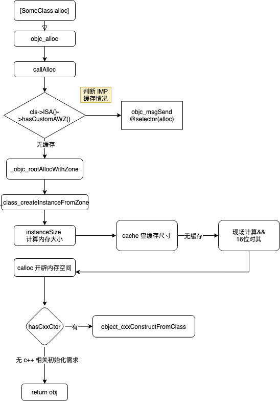

# objc_alloc

* `objc_alloc`
  * 概述
    * `objc_alloc`是NSObject的类的分配空间，常和`objc_init`搭配使用
  * 定义
    ```c
    id objc_alloc(Class cls)
    ```
  * objc的类的alloc的主要流程
    * 

# 心得

### alloc分配后的=新建的空的类：描述为空

IDA伪代码：

```bash
  newWASignedPrekey = objc_alloc_3808((Class)&OBJC_CLASS___WASignedPrekey);
```

Xcode汇编代码：

```asm
  0x10a6b89e4 <+88>:    bl     0x10a73b808              ; symbol stub for: objc_alloc_3808
```

运行后，返回值：

```bash
(lldb) reg r x0
      x0 = 0x0000000280a23400
(lldb) po $x0
<object returned empty description>
```

即：

* alloc空的类，`po`返回空的描述信息
  * `<object returned empty description>`


不过，是可以通过class查看具体是什么类的：

```bash
(lldb) po [$x0 class]
WASignedPrekey
```

符合我们的期望。
