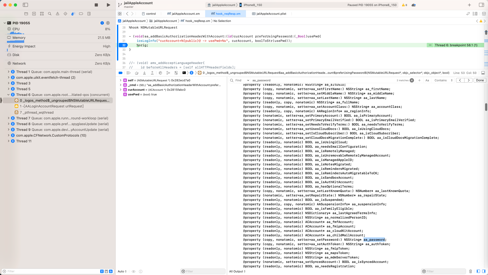
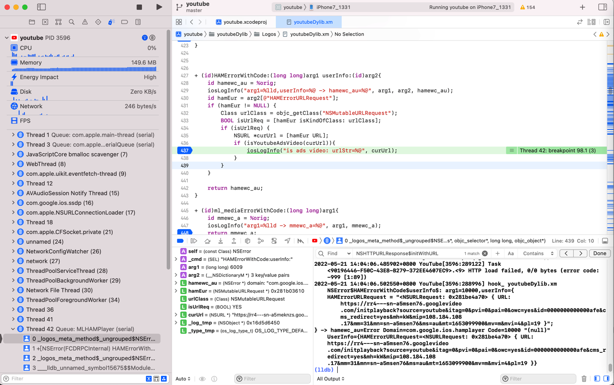
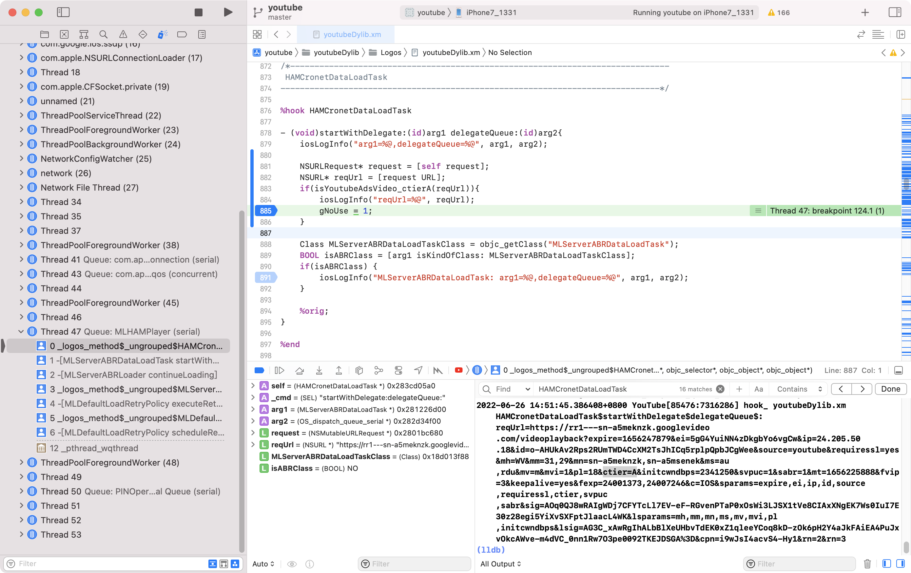
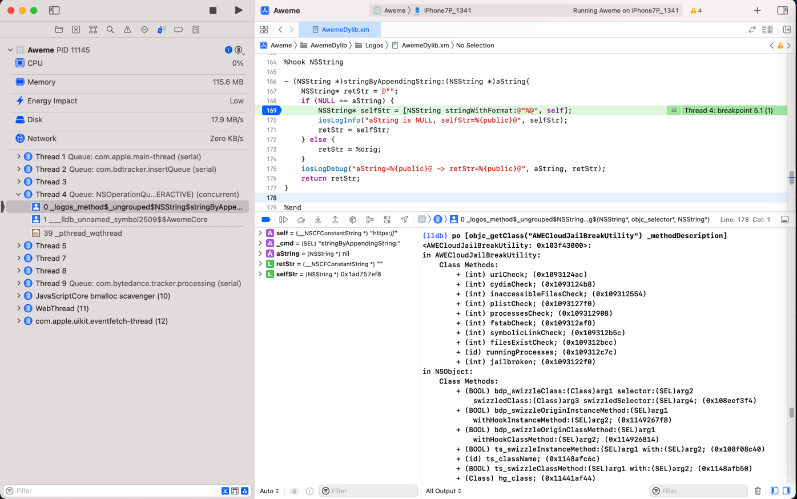

# 应用举例

## libobjc.A.dylib

```bash
0000000012664BF0        _objc_getClass    /usr/lib/libobjc.A.dylib
```

## 获取多个类

```objc
Class NSMutableURLRequestClass = objc_getClass("NSMutableURLRequest");
Class NSErrorClass = objc_getClass("NSError");
Class NSDictionaryClass = objc_getClass("NSDictionary");

Class HAMCronetDataLoadTaskClass = objc_getClass("HAMCronetDataLoadTask");
```

## Frida调试时的`Module.findExportByName`

```js
var objc_getClass = new NativeFunction(
    Module.findExportByName(null, 'objc_getClass'),
    'pointer',
    ['pointer']
)
console.log("objc_getClass=" + objc_getClass)
```

## AKAppleIDAuthSupportProxyImpl

```objc
Class AKAppleIDAuthSupportProxyImplClass = objc_getClass("AKAppleIDAuthSupportProxyImpl");
```

## BSObjCBlockArgument

```objc
Class BSObjCBlockArgumentClass = objc_getClass("BSObjCBlockArgument");
```

## `__NSXPCInterfaceProxy_AKAppleIDAuthenticationDaemonProtocol`

```objc
id AuthDaemonProtocolProxy = objc_getClass("__NSXPCInterfaceProxy_AKAppleIDAuthenticationDaemonProtocol");
```

## AASignInFlowController

```bash
(lldb) po [objc_getClass("AASignInFlowController") _shortMethodDescription]
<AASignInFlowController: 0x1f19cb2e0>:
in AASignInFlowController:
...
```

## ACAccount

```bash
(lldb) po [objc_getClass("ACAccount") _shortMethodDescription]
<ACAccount: 0x1f0973718>:
...
        @property (copy, nonatomic, setter=aa_setPassword:) NSString* aa_password;
...
        - (id) aa_password; (0x192622320)
```



## NSMutableURLRequest

```bash
(lldb) po objc_getClass("NSMutableURLRequest")
NSMutableURLRequest

(lldb) po objc_getClass("NSMutableURLRequest(AppleAccount)")
 nil
```

和：

```bash
(lldb) po [objc_getClass("NSMutableURLRequest") _shortMethodDescription]
<NSMutableURLRequest: 0x1f0916f10>:
in NSMutableURLRequest:
     Class Methods:
         + (int) hashForPlayerID:(id)arg1; (0x1ab494e78)
...
```

和：

```objc
+ (id)HAMErrorWithCode:(long long)arg1 userInfo:(id)arg2{
    id hamewc_au = %orig;
    iosLogInfo("arg1=%lld,userInfo=%@ -> hamewc_au=%@", arg1, arg2, hamewc_au);
    id hamEur = arg2[@"HAMErrorURLRequest"];
    if (hamEur != NULL) {
        Class urlClass = objc_getClass("NSMutableURLRequest");
        BOOL isUrlReq = [hamEur isKindOfClass: urlClass];
        if (isUrlReq) {
            NSURL *curUrl = [hamEur URL];
            if (isYoutubeAdsVideo(curUrl)){
                iosLogInfo("is ads video: urlStr=%@", curUrl);
            }
        }
    }

    return hamewc_au;
}
```




## UIDevice

```bash
(lldb) po [objc_getClass("UIDevice") _shortMethodDescription]
...
    + (id) networkType:(BOOL)arg1; (0x10ebbbc78)
    + (void) clearTid; (0x10ebbc554)
    + (id) tid; (0x10ebbc43c)
    + (id) currentVersion; (0x10ebbc758)
    + (id) networkType; (0x10ebbbbd4)
    + (id) userAgent; (0x10ebbaf34)
    + (id) imsi; (0x10ebbb74c)
    + (id) osVersion; (0x10ebbb830)
    + (id) udid; (0x10ebbc260)
    + (id) imei; (0x10ebbb6e4)
    + (id) clientKey; (0x10ebbb7a4)
    + (id) wifiInterface; (0x10ebbba4c)
```

和：

```bash
(lldb) po [objc_getClass("UIDevice") _shortMethodDescription]
2022-03-28 14:18:09.536479+0800 Aweme[39046:2680735] hook_dyld.xm _NSGetExecutablePath: buf=(null),*bufsize=96 -> extPathCpSize=-1
2022-03-28 14:18:09.536697+0800 Aweme[39046:2680735] hook_dyld.xm _NSGetExecutablePath: buf=/private/var/containers/Bundle/Application/B9FB3ACC-61E5-4030-B89C-C9FF71822F6E/Aweme.app/Aweme,*bufsize=96 -> extPathCpSize=0
[39046:28419:0328/141743.229303:ERROR:ssl_client_socket_impl.cc(1018)] handshake failed; returned -1, SSL error code 1, net_error -100
2022-03-28 14:18:09.604818+0800 Aweme[39046:2680736] hook_misc.xm NSBundle$bundlePath: origBundlePath=/usr/lib
<UIDevice: 0x1dfc62a88>:
in UIDevice:
     Class Methods:
         + (void) tspk_preload; (0x11401a864)
         + (BOOL) isPoorthaniPhone6s; (0x113d8d760)
         + (id) deviceMachineModel; (0x113d8d6e0)
...
```

## BSObjCBlockArgument

```objc
Class BSObjCBlockArgumentClass = objc_getClass("BSObjCBlockArgument");

%hookf(id, objc_alloc_init, Class cls){
    id newObj = %orig;
    bool shouldOmit = false;
    if (newObj == nil) {
        shouldOmit = true;
    } else {
        shouldOmit = [newObj isKindOfClass: BSObjCBlockArgumentClass];
    }

    if (shouldOmit) {
        iosLogInfo("cls=%{public}@", cls);
    } else {
        iosLogInfo("cls=%{public}@, newObj=%{public}@", cls, newObj);
    }
    return newObj;
}
```

## NSURLSessionTask

```bash
(lldb) po [objc_getClass("NSURLSessionTask") _shortMethodDescription]
<NSURLSessionTask: 0x1db04c418>:
in NSURLSessionTask:
...
  - (void) updateCurrentRequest:(id)arg1; (0xd451b481820be210)
...
(NSObject ...)
```

## `__NSCFLocalSessionTask`

```bash
(lldb) po [objc_getClass("__NSCFLocalSessionTask") _shortMethodDescription]
<__NSCFLocalSessionTask: 0x1db04b130>:
in __NSCFLocalSessionTask:
...
(NSURLSessionTask ...)


(lldb) po [objc_getClass("NSURLSessionTask") _shortMethodDescription]
<NSURLSessionTask: 0x1db04c418>:
in NSURLSessionTask:
...
(NSObject ...)
```

和：

```bash
(lldb) po objc_getClass("__NSCFLocalSessionTask")
__NSCFLocalSessionTask


(lldb) po [objc_getClass("__NSCFLocalSessionTask") _shortMethodDescription]
<__NSCFLocalSessionTask: 0x1db04b130>:
in __NSCFLocalSessionTask:
     Properties:
         @property (retain) __NSCFURLSessionConnection* cfConn;  (@synthesize cfConn = _cfConn;)
         @property (readonly) unsigned long hash;
         @property (readonly) Class superclass;
         @property (readonly, copy) NSString* description;
         @property (readonly, copy) NSString* debugDescription;
     Instance Methods:
         - (BOOL) _needSendingMetrics; (0xcb62020182126ffc)
         - (void) set_timeoutIntervalForResource:(double)arg1; (0x8330f881820edfac)
         - (void) _onqueue_needConnectedSocketToHost:(id)arg1 port:(unsigned long)arg2 withCompletion:(^block)arg3; (0xec7a7a81821274d0)
         - (void) _didSendMetrics; (0xe7713281820970a8)
         - (void) _onqueue_needNewBodyStream:(id)arg1 withCompletion:(^block)arg2; (0x7d19ae0182127aac)
         - (void) _askForConnectedSocketLater; (0x464f6f0182127174)
         - (void) _onqueue_didSendBodyBytes:(long)arg1 totalBytesSent:(long)arg2 totalBytesExpectedToSend:(long)arg3; (0x46279c8182127440)
         - (void) _onqueue_didReceiveResponse:(id)arg1 completion:(^block)arg2; (0x6c56be8182128364)
         - (void) _onqueue_willSendRequestForEstablishedConnection:(id)arg1 withCompletion:(^block)arg2; (0x8341b28182127510)
         - (void) _onqueue_expectedProgressTargetChanged; (0x739ef01821272cc)
         - (void) connection:(id)arg1 didReceiveTCPConnection:(struct shared_ptr<TransportConnection>)arg2 extraBytes:(id)arg3; (0x452b338182126294)
         - (void) _onqueue_completeInitialization; (0x40183981820a8368)
         - (void) connection:(id)arg1 waitingWithReason:(long)arg2; (0x47404d018209c934)
         - (id) _onqueue_strippedMutableRequest; (0xac30cb0182096124)
         - (void) _onqueue_connectionWaitingWithReason:(long)arg1; (0x86127501820ef240)
         - (void) connection:(id)arg1 challenged:(id)arg2 authCallback:(^block)arg3; (0x3e299f818212697c)
         - (void) set_TLSMaximumSupportedProtocolVersion:(unsigned short)arg1; (0x9e501c0182127014)
         - (void) _onqueue_cancel_with_error:(id)arg1; (0xa249fa818209c808)
         - (id) cfConn; (0x200b80182096b98)
         - (void) startResourceTimer; (0x2c288e0182102810)
         - (void) dealloc; (0x9f3d55018209f020)
         - (void) _task_onqueue_didFinish; (0x8b18df018209b804)
         - (void) _onqueue_didReceiveChallenge:(id)arg1 request:(id)arg2 withCompletion:(^block)arg3; (0x2d6fa20182127c80)
         - (void) _onqueue_didReceiveResponse:(id)arg1 redirectRequest:(id)arg2 withCompletion:(^block)arg3; (0x7d5f4c0182127d5c)
         - (void) setCfConn:(id)arg1; (0x101dc581820a7544)
         - (void) connection:(id)arg1 willCacheResponse:(id)arg2 responseCallback:(^block)arg3; (0x4925940182126b64)
         - (void) _onqueue_willCacheResponse:(id)arg1 withCompletion:(^block)arg2; (0xa257eb0182127bdc)
         - (void) _onqueue_setupNextEffectiveConfigurationWithCompletionHandler:(^block)arg1; (0xb1070201820da7c0)
         - (void) _task_onqueue_didReceiveDispatchData:(id)arg1 completionHandler:(^block)arg2; (0x2f187c0182127acc)
         - (void) _setConnectionCacheKey:(void*)arg1; (0x90318a81820dfea0)
         - (void) _onqueue_conditionalRequirementsChanged:(BOOL)arg1; (0x745cb601821274f4)
         - (void) _onqueue_didReceiveDispatchData:(id)arg1 completion:(^block)arg2; (0x403100818210379c)
         - (id) .cxx_construct; (0xdf2cb201820ac9a8)
         - (void) didReceiveInformationalResponse:(id)arg1; (0x263dad8182127214)
         - (void) connection:(id)arg1 wasRedirected:(id)arg2 newRequest:(id)arg3 responseCallback:(^block)arg4; (0x490e8c8182126e6c)
         - (id) error:(id)arg1 code:(long)arg2; (0x764ad8818209d410)
         - (id) resourceTimeoutError; (0x194506018212716c)
         - (void) cancel_with_error:(id)arg1; (0xeb40d781820ebfc0)
         - (void) _private_onqueue_didReceiveResponseDisposition:(long)arg1 completion:(^block)arg2; (0x1c5fe301820ee1a8)
         - (void) connection:(id)arg1 sentBodyBytes:(id)arg2 totalBytes:(id)arg3 expectedBytes:(id)arg4; (0x8e66eb8182126768)
         - (void) connection:(id)arg1 _conditionalRequirementsChanged:(BOOL)arg2; (0x9b6afe81821265dc)
         - (void) _onqueue_suspend; (0x696304018212733c)
         - (void) connection:(id)arg1 didReceiveSocketInputStream:(id)arg2 outputStream:(id)arg3; (0x13147181821264a8)
         - (void) _onqueue_adjustBytesPerSecondLimit:(long)arg1; (0xc642a401820cb594)
         - (void) connection:(id)arg1 _willSendRequestForEstablishedConnection:(id)arg2 completion:(^block)arg3; (0xbd707e81821266ac)
         - (void) connection:(id)arg1 needConnectedSocketToHost:(id)arg2 port:(unsigned long)arg3 completion:(^block)arg4; (0x121d9a01821261d8)
         - (void) _onSessionQueue_disavow; (0x2d108281820b31a8)
         - (void) connectionWillFinishLoading:(id)arg1; (0xa4315f81820985ec)
         - (void) connection:(id)arg1 didFinishLoadingWithError:(id)arg2; (0x9b13df0182096da4)
         - (void) _onqueue_adjustPriorityHint:(float)arg1 incremental:(BOOL)arg2; (0x614e3981821072f0)
         - (void) connection:(id)arg1 request:(id)arg2 needsNewBodyStreamCallback:(^block)arg3; (0x5023a80182126a84)
         - (void) _onqueue_resume; (0x1a17170182093ee0)
         - (id) initWithOriginalRequest:(id)arg1 ident:(unsigned long)arg2 taskGroup:(id)arg3; (0x33449081820d1200)
         - (void) connection:(id)arg1 didReceiveResponse:(id)arg2 completion:(^block)arg3; (0xce3ea90182126c20)
         - (void) connection:(id)arg1 didReceiveData:(id)arg2 completion:(^block)arg3; (0x6a146c818210aa14)
         - (void) _onqueue_didFinishWithError:(id)arg1; (0x8579f2018209b34c)
         - (void) set_TLSMinimumSupportedProtocolVersion:(unsigned short)arg1; (0x2a6c6e81820fc554)
         - (void) _onqueue_cancel; (0xca661b81821273d4)
         - (void) _onqueue_adjustLoadingPoolPriority; (0x76776b0182127330)
         - (void) _onqueue_adjustPoolPriority; (0x9a775b01821056f0)
         - (void) .cxx_destruct; (0x1673e40182097d60)
         - (id) initWithBackgroundTaskInfo:(id)arg1 taskGroup:(id)arg2; (0xfe63a08182128374)
(NSURLSessionTask ...)
```

## NSURLRequest

```bash
(lldb) po [objc_getClass("NSURLRequest") _shortMethodDescription]
<NSURLRequest: 0x1db68ffb8>:
in NSURLRequest:
     Class Methods:
         + (id) safari_nonAppInitiatedRequestWithURL:(id)arg1; (0x19c71ba04)
         + (id) sl_urlRequestWithToken:(id)arg1 forURLString:(id)arg2; (0x1ba629030)
         + (id) wlk_requestWithURL:(id)arg1 httpMethod:(id)arg2 httpBody:(id)arg3 httpHeaders:(id)arg4 cachePolicy:(unsigned long)arg5 timeout:(double)arg6; (0x1bce5172c)
         + (id) wlk_requestWithURL:(id)arg1 httpMethod:(id)arg2 httpHeaders:(id)arg3 cachePolicy:(unsigned long)arg4 timeout:(double)arg5; (0x1bce5db9c)
         + (void) setAllowsSpecificHTTPSCertificate:(id)arg1 forHost:(id)arg2; (0x1828e4340)
         + (id) requestWithURL:(id)arg1 cachePolicy:(unsigned long)arg2 timeoutInterval:(double)arg3; (0x100d8c344)
         + (BOOL) supportsSecureCoding; (0x182705ee0)
         + (id) allowsSpecificHTTPSCertificateForHost:(id)arg1; (0x18274b6b8)
         + (void) setAllowsAnyHTTPSCertificate:(BOOL)arg1 forHost:(id)arg2; (0x100d8cb08)
         + (BOOL) allowsAnyHTTPSCertificateForHost:(id)arg1; (0x100d8ca2c)
         + (double) defaultTimeoutInterval; (0x1828e3c64)
         + (void) setDefaultTimeoutInterval:(double)arg1; (0x1828e3c74)
         + (id) requestWithURL:(id)arg1; (0x100d8bcb4)
     Properties:
         @property (readonly, nonatomic) NSDictionary* ams_cookies;
         @property (readonly, nonatomic) BOOL ams_requestIsBagLoad;
         @property (readonly, copy) NSString* HTTPMethod;
         @property (readonly, copy) NSDictionary* allHTTPHeaderFields;
         @property (readonly, copy) NSData* HTTPBody;
         @property (readonly, retain) NSInputStream* HTTPBodyStream;
         @property (readonly) BOOL HTTPShouldHandleCookies;
         @property (readonly) BOOL HTTPShouldUsePipelining;
         @property (readonly) void* _inner;
         @property (readonly, copy) NSURL* URL;
         @property (readonly) unsigned long cachePolicy;
         @property (readonly) double timeoutInterval;
         @property (readonly, copy) NSURL* mainDocumentURL;
         @property (readonly) unsigned long networkServiceType;
         @property (readonly) BOOL allowsCellularAccess;
         @property (readonly) BOOL allowsExpensiveNetworkAccess;
         @property (readonly) BOOL allowsConstrainedNetworkAccess;
         @property (readonly) BOOL assumesHTTP3Capable;
         @property (readonly) unsigned long attribution;
     Instance Methods:
         - (BOOL) ak_usesHTTPSScheme; (0x1949fef0c)
         - (id) aa_HTTPBody; (0x194aea7b4)
         - (id) body; (0x18649c274)
         - (id) ams_cookies; (0x18649c484)
         - (id) ams_valueForHTTPHeader:(id)arg1; (0x1860a5440)
         - (BOOL) ams_requestIsBagLoad; (0x1860d5e3c)
         - (id) DARequestByApplyingStorageSession:(struct __CFURLStorageSession*)arg1; (0x19fd45d70)
         - (id) safari_requestBySettingIsNonAppInitiated:(BOOL)arg1; (0x19c75f0d8)
         - (id) initWithXPCEncoding:(id)arg1; (0x194f6d810)
         - (id) copyXPCEncoding; (0x194f6d80c)
         - (id) ic_valueForHTTPHeaderField:(id)arg1; (0x1994f63e4)
         - (id) ic_valuesForCookieWithName:(id)arg1; (0x1994f6178)
         - (BOOL) allowsExpensiveNetworkAccess; (0x1828e3b14)
         - (const struct __CFURL*) cfURL; (0x18271a284)
         - (id) init; (0x182722e14)
         - (void) dealloc; (0x1826d8b90)
         - (unsigned long) cachePolicy; (0x1826d9420)
         - (double) timeoutInterval; (0x1826f430c)
         - (id) HTTPMethod; (0x1826edaa8)
         - (BOOL) _ignoreHSTS; (0x1826ed60c)
         - (id) HTTPBodyStream; (0x18272d438)
         - (id) initWithURL:(id)arg1 cachePolicy:(unsigned long)arg2 timeoutInterval:(double)arg3; (0x100d8c6b8)
         - (id) mutableCopyWithZone:(struct _NSZone*)arg1; (0x1826d40ec)
         - (BOOL) _URLHasScheme:(id)arg1; (0x18273dfac)
         - (BOOL) _isIdempotent; (0x1828e3d38)
         - (id) HTTPReferrer; (0x1828e3ed4)
         - (BOOL) allowsCellularAccess; (0x1826fccc4)
         - (id) contentDispositionEncodingFallbackArray; (0x18270ec34)
         - (struct _CFURLRequest*) _CFURLRequest; (0x1826ea308)
         - (id) HTTPUserAgent; (0x1828e3ec0)
         - (id) _initWithInternal:(id)arg1; (0x1826d6b0c)
         - (id) _propertyForKey:(id)arg1; (0x1826ff158)
         - (id) _startTimeoutDate; (0x182749c38)
         - (BOOL) _schemeWasUpgradedDueToDynamicHSTS; (0x1826e4300)
         - (BOOL) _isSafeRequestForBackgroundDownload; (0x18270d3dc)
         - (id) allHTTPHeaderFields; (0x1826f0d7c)
         - (void) _removePropertyForKey:(id)arg1; (0x1828e3b6c)
         - (id) _copyReplacingURLWithURL:(id)arg1; (0x1828e3b78)
         - (double) _timeWindowDelay; (0x1827299f4)
         - (id) _allHTTPHeaderFieldsAsArrays; (0x1828e3f48)
         - (id) HTTPContentType; (0x1828e3f34)
         - (id) HTTPExtraCookies; (0x1828e3ee8)
         - (unsigned long) expectedWorkload; (0x1828e3df0)
         - (BOOL) _isNonAppInitiated; (0x1828e3a60)
         - (BOOL) allowsConstrainedNetworkAccess; (0x1828e3b40)
         - (double) _payloadTransmissionTimeout; (0x1828e3dcc)
         - (void) _setProperty:(id)arg1 forKey:(id)arg2; (0x1826f7c20)
         - (BOOL) assumesHTTP3Capable; (0x1828e3ae8)
         - (BOOL) _preventHSTSStorage; (0x1826face0)
         - (id) URL; (0x1826d68d0)
         - (BOOL) _needsNetworkTrackingPrevention; (0x1828e3a8c)
         - (BOOL) _requiresShortConnectionTimeout; (0x1826f0cb4)
         - (BOOL) HTTPShouldHandleCookies; (0x1826fbbd0)
         - (BOOL) HTTPShouldUsePipelining; (0x1828e3e14)
         - (id) initWithURL:(id)arg1; (0x100d8bffc)
         - (unsigned long) attribution; (0x1828e3ac4)
         - (void) encodeWithCoder:(id)arg1; (0x1826ff18c)
         - (void*) _inner; (0x1826d43a4)
         - (BOOL) isEqual:(id)arg1; (0x1828e3c88)
         - (id) description; (0x18270bb98)
         - (id) copyWithZone:(struct _NSZone*)arg1; (0x1828e3c84)
         - (unsigned long) networkServiceType; (0x18270b828)
         - (id) initWithCoder:(id)arg1; (0x18272e070)
         - (id) mainDocumentURL; (0x182705ef8)
         - (id) _initWithCFURLRequest:(struct _CFURLRequest*)arg1; (0x18270f3f4)
         - (unsigned long) hash; (0x1828e3cf8)
         - (id) valueForHTTPHeaderField:(id)arg1; (0x1826d7e6c)
         - (id) _trackerContext; (0x1828e3a3c)
         - (BOOL) _isKnownTracker; (0x1828e3a98)
         - (id) boundInterfaceIdentifier; (0x182726f54)
         - (id) HTTPBody; (0x1826d43d0)
         - (double) _timeWindowDuration; (0x182732910)
(NSObject ...)
```

## IBARevealProtocol

```py
    def getRevealServerProtocolVersion(self):
        expression = "(int)[objc_getClass(\"IBARevealProtocol\") protocolVersion]"
        return self.frame.EvaluateExpression(expression, GetCommonExpressionOptions()).signed
```

## YTIAdBreakRequest

```bash
(lldb) expr id $adbreakClass = (id)objc_getClass("YTIAdBreakRequest")
(lldb) po $adbreakClass
YTIAdBreakRequest
```

和：

```bash
expr YTIAdBreakRequest* $adbreakObj = (YTIAdBreakRequest*)[objc_getClass("YTIAdBreakRequest") parseFromData: newHttpBodyData]

(lldb) po $adbreakObj
2022-10-17 11:57:55.875251+0800 YouTube[21038:2204921] hook_ youtubeReqResp.xm YTIInnerTubeContext$descriptor: curDesc=<GPBDescriptor: 0x2803e7a40>
<YTIAdBreakRequest 0x28613d960>: {
    context {
      client {
        hl: "zh-CN"
        gl: "CN"
        carrier_geo: "CN"
        device_make: "Apple"
        device_model: "iPhone9,1"
        client_name: IOS
        client_version: "17.08.2"
        os_name: "iOS"
        os_version: "13.3.1.17D50"
        screen_width_points: 375
        screen_height_points: 667
        screen_pixel_density: 2
        client_form_factor: SMALL_FORM_FACTOR
        window_width_points: 375
        window_height_points: 667
        connection_type: CONN_WIFI
...
```

## YTIContentPlaybackContext

```bash
(lldb) po [[objc_getClass("YTIContentPlaybackContext") descriptor] fields]
<__NSArrayM 0x280cfd8f0>(
<GPBFieldDescriptor: 0x28392f430>,
<GPBFieldDescriptor: 0x28392f480>,
<GPBFieldDescriptor: 0x28392f4d0>,
<GPBFieldDescriptor: 0x28392f520>,
...
<GPBFieldDescriptor: 0x2839540f0>,
<GPBFieldDescriptor: 0x283954140>,
<GPBFieldDescriptor: 0x283954190>
)
```

## YTIClientInfo

```bash
(lldb) po [[objc_getClass("YTIClientInfo") descriptor] fields]
<__NSArrayM 0x2817da910>(
<GPBFieldDescriptor: 0x283b95f90>,
<GPBFieldDescriptor: 0x283b95f40>,
<GPBFieldDescriptor: 0x283b95ef0>,
...
<GPBFieldDescriptor: 0x283b92bc0>,
<GPBFieldDescriptor: 0x283b92c10>,
<GPBFieldDescriptor: 0x283b92c60>
)
```

## GPBMessage

```bash
(lldb) po objc_getClass("GPBMessage")
GPBMessage
```

和：加了临时变量的

```bash
expr id $protoClass = (id)objc_getClass("GPBMessage")

(lldb) po $protoClass
GPBMessage
```

和：继续调用函数`parseFromData`

```bash
(lldb) po [objc_getClass("GPBMessage") parseFromData: neGpbwData]
<GPBMessage 0x282bc4460>: {
    # --- Unknown fields ---
    1: "com.google.ssoauth#com.google.ios.youtube"
    2: 430166894
    4: "com.google.ios.youtube"
    5: 1661306181
    6: 0x19A3D36E
}
```

## MLServerABRDataLoadTask

```objc
%hook HAMCronetDataLoadTask

- (void)startWithDelegate:(id)arg1 delegateQueue:(id)arg2{
    iosLogInfo("arg1=%@,delegateQueue=%@", arg1, arg2);

    Class MLServerABRDataLoadTaskClass = objc_getClass("MLServerABRDataLoadTask");
    BOOL isABRClass = [arg1 isKindOfClass: MLServerABRDataLoadTaskClass];
    if(isABRClass) {
        iosLogInfo("MLServerABRDataLoadTask: arg1=%@,delegateQueue=%@", arg1, arg2);
    }

    %orig;
}

%end
```



和：

```objc
Class MLServerABRDataLoadTaskClass = objc_getClass("MLServerABRDataLoadTask");

bool isMLServerABRDataLoadTaskClass(id curObj){
    bool isABRClass = [curObj isKindOfClass: MLServerABRDataLoadTaskClass];
    return isABRClass;
}

- (void)dataLoadTask:(id)arg1 didReceiveData:(id)arg2{
    if(isMLServerABRDataLoadTaskClass(arg1)) {
        NSURLRequest* request = [arg1 request];
        NSURL* reqUrl = [request URL];
        if (isYoutubeAdsVideo_ctier(reqUrl)){
            iosLogInfo("isYoutubeAdsVideo_ctier: arg1=%@, didReceiveData=%@", arg1, arg2);
            gNoUse = 1;
        }
    } else{
        gNoUse = 1;
    }

    %orig;
}
```

## IESLiveDeviceInfo

```bash
(lldb) po [objc_getClass("IESLiveDeviceInfo") _shortMethodDescription]
<IESLiveDeviceInfo: 0x105fb1bc0>:
in IESLiveDeviceInfo:
     Class Methods:
         + (unsigned long) ieslive_defaultSupportOrientation; (0x10d8bffcc)
         + (long) ieslive_defaultPreferredInterfaceOrientation; (0x10d8c0020)
         + (id) carrierMCCMNC; (0x10c9f9060)
         + (BOOL) shouldUseCanOpenURLMethod; (0x10c9f9158)
         + (id) developmentNumber; (0x10c9f91d8)
         + (unsigned long) defaultSupportOrientation; (0x10c9f927c)
         + (long) defaultPreferredInterfaceOrientation; (0x10c9f9284)
         + (long) defaultPreferredInterfaceOrientationForLandscapeMode; (0x10c9f928c)
         + (id) deviceType; (0x10c9f8f0c)
         + (id) MACAddress; (0x10c9f8f20)
(NSObject ...)
```

## AWEAPMManager

```bash
(lldb) po [objc_getClass("AWEAPMManager") _shortMethodDescription]
<AWEAPMManager: 0x1061df680>:
in AWEAPMManager:
     Class Methods:
         + (void) setPerformanceUploadHost:(id)arg1; (0x10aefa058)
         + (void) attchFilter:(id)arg1 forKey:(id)arg2; (0x113f630b0)
         + (void) attachInfo:(id)arg1 forKey:(id)arg2; (0x10b0ee530)
         + (void) enableInternalNetworkRequest:(BOOL)arg1; (0x10af0d3b8)
         + (void) setupInformationWithCustomHandler:(^block)arg1; (0x10aef40b4)
         + (void) trackerSessionDidChange:(id)arg1; (0x113f631c0)
         + (BOOL) enableToutiaoAPM; (0x10af0506c)
         + (id) signInfo; (0x113f63288)
         + (void) setupInformation; (0x113f62f18)
         + (id) sharedInstance; (0x10aef44f4)
         + (void) start; (0x10af05024)
         + (void) setUserID:(id)arg1; (0x10af00224)
         + (void) setUserName:(id)arg1; (0x10af00274)
     Instance Methods:
         - (void) bytedSettingDidChange; (0x113f63150)
         - (id) init; (0x10aef4568)
         - (void) dealloc; (0x113f63044)
(NSObject ...)
```

和：

```bash
(lldb) po [objc_getClass("AWEAPMManager") signInfo]
2022-06-21 15:05:16.241786+0800 Aweme[76410:6169642] hook_misc.xm NSBundle$pathForResource$ofType$: name=embedded, ext=mobileprovision -> resPath=/private/var/containers/Bundle/Application/BE37087C-4861-4FEA-AD61-82FED979134B/Aweme.app/embedded.mobileprovision
AppStore
```

## CheckMethodSwizzle

```c
...
@implementation HookProtect
BOOL CheckMethodSwizzle(const char* className, char *selName) {
    Dl_info info;
    IMp imp = class_getMethodImplementation(objc_getclass(className), sel_registerName(selName));
...
```


## getHamErrReqUrl

```c
Class NSMutableURLRequestClass = objc_getClass("NSMutableURLRequest");
Class NSErrorClass = objc_getClass("NSError");
Class NSDictionaryClass = objc_getClass("NSDictionary");

//NSURL* getHamErrReqUrl(NSError* curError){
NSURL* getHamErrReqUrl(id erroOrDict){
    NSURL* curUrl = NULL;
//    if (curError) {
    if (erroOrDict) {
        NSDictionary* curUserInfo = NULL;
        if ([erroOrDict isKindOfClass: NSErrorClass]){
            curUserInfo = [erroOrDict userInfo];
        } else if ([erroOrDict isKindOfClass: NSDictionaryClass]) {
            curUserInfo = (NSDictionary*)erroOrDict;
        }
        
        if (curUserInfo) {
            id hamErrUrlReq = curUserInfo[@"HAMErrorURLRequest"];
            if (hamErrUrlReq != NULL) {
                BOOL isUrlReq = [hamErrUrlReq isKindOfClass: NSMutableURLRequestClass];
                if (isUrlReq) {
                    curUrl = [hamErrUrlReq URL];
                }
            }
        }
    }

    return curUrl;
}
```


## AWEAppSettings

```bash
(lldb) po objc_getClass("AWEAppSettings")
AWEAppSettings
```

## AWEFriendsWidgetsColorSchemeResolutionResult

```bash
(lldb) po [objc_getClass("AWEFriendsWidgetsColorSchemeResolutionResult") _shortMethodDescription]
<AWEFriendsWidgetsColorSchemeResolutionResult: 0x10596a158>:
in AWEFriendsWidgetsColorSchemeResolutionResult:
     Class Methods:
         + (id) successWithResolvedFriendsWidgetsColorScheme:(long)arg1; (0x11124c3a0)
         + (id) confirmationRequiredWithFriendsWidgetsColorSchemeToConfirm:(long)arg1; (0x11124c3d8)
(INEnumResolutionResult ...)
```

## UIImage

```bash
(lldb) po [objc_getClass("UIImage") _shortMethodDescription]
<UIImage: 0x1fc9f33e8>:
in UIImage:
    Class Methods:
...
        + (id) awe_userRecommendImageNamed:(id)arg1; (0x114d06fcc)
        + (id) awe_userRecommendImageNamed:(id)arg1 compatibleWithTraitCollection:(id)arg2; (0x114d06fdc)
```

## AWEUserRecommend

```bash
(lldb) po objc_getClass("UIImage(AWEUserRecommend)")
 nil

(lldb) po [objc_getClass("UIImage(AWEUserRecommend)") _shortMethodDescription]
 nil

(lldb) po [objc_getClass("UIImage") _shortMethodDescription]
<UIImage: 0x1fc9f33e8>:
in UIImage:
     Class Methods:
         + (id) yy_imageWithColor:(id)arg1; (0x10a74a560)
         + (id) yy_imageWithColor:(id)arg1 size:(struct CGSize)arg2; (0x10aad5334)
...
        - (BOOL) isFromStatusBarImageProvider; (0x1b81c15a4)
(NSObject ...)
```

## AWEPlayInteractionFollowSuccessElement

```bash
(lldb) po [objc_getClass("AWEPlayInteractionFollowSuccessElement") _shortMethodDescription]
2022-04-02 13:36:53.128548+0800 Aweme[45939:3543378] hook_misc.xm NSBundle$bundlePath: origBundlePath=/usr/lib
<AWEPlayInteractionFollowSuccessElement: 0x10629ab90>:
in AWEPlayInteractionFollowSuccessElement:
     Properties:
         @property (retain, nonatomic) AWEAntiAddictedNoticeBarView* antiAddictedNoticeBarView;  (@synthesize antiAddictedNoticeBarView = _antiAddictedNoticeBarView;)
...
        - (BOOL) appear; (0x10b00f010)
(NSObject ...)
```

## YTAdVideoPlayerOverlayViewController

```bash
(lldb) po [objc_getClass("YTAdVideoPlayerOverlayViewController") _shortMethodDescription]
<YTAdVideoPlayerOverlayViewController: 0x10c030f50>:
in YTAdVideoPlayerOverlayViewController:
...
        - (void) setMediaTime:(double)arg1; (0x1065e627c)
```

## YTPlaybackData

```bash
(lldb) po [objc_getClass("YTPlaybackData") _shortMethodDescription]
<YTPlaybackData: 0x1085737c0>:
in YTPlaybackData:
     Class Methods:
         + (id) playbackDataWithPlayerResponse:(id)arg1 CPN:(id)arg2; (0x1032d8060)
         + (id) playbackDataWithAd:(id)arg1; (0x102b2a228)
         + (id) playbackDataWithPlayerResponse:(id)arg1; (0x1032d8050)
     Properties:
         @property (readonly, nonatomic) YTPlayerResponse* playerResponse;  (@synthesize playerResponse = _playerResponse;)
         @property (readonly, nonatomic) YTPlaybackData* trailer;  (@synthesize trailer = _trailer;)
         @property (readonly, nonatomic) MLVideo* video;  (@synthesize video = _video;)
         @property (readonly, nonatomic, getter=isPlayableInBackground) BOOL playableInBackground;
         @property (readonly, nonatomic) YTCPN* CPN;  (@synthesize CPN = _CPN;)
         @property (readonly, nonatomic, getter=isPlayable) BOOL playable;
     Instance Methods:
         - (id) CPN; (0x1032d8724)
         - (BOOL) isPlayableInBackground; (0x1032d866c)
         - (id) trailer; (0x1032d8714)
         - (id) initWithPlayerResponse:(id)arg1 CPN:(id)arg2; (0x1032d80d8)
         - (void) .cxx_destruct; (0x1032d872c)
         - (BOOL) isPlayable; (0x1032d865c)
         - (id) video; (0x1032d871c)
         - (id) playerResponse; (0x1032d870c)
(NSObject ...)
```

## IESECSettingRegisterHandler

```bash
(lldb) po [objc_getClass("IESECSettingRegisterHandler") _shortMethodDescription]
<IESECSettingRegisterHandler: 0x105f689a8>:
in IESECSettingRegisterHandler:
     Properties:
         @property (retain, nonatomic) NSValue* handlerPointer;  (@synthesize handlerPointer = _handlerPointer;)
         @property (nonatomic) BOOL registed;  (@synthesize registed = _registed;)
     Instance Methods:
         - (id) handlerPointer; (0x10ad936fc)
         - (void) setHandlerPointer:(id)arg1; (0x10ad9364c)
         - (BOOL) registed; (0x10ad93704)
         - (void) setRegisted:(BOOL)arg1; (0x10ad93644)
         - (void) .cxx_destruct; (0x116319b18)
(NSObject ...)
```

## MDXSession

```bash
(lldb) po [objc_getClass("MDXSession") _shortMethodDescription]
<MDXSession: 0x10151cb40>:
in MDXSession:
     Class Methods:
         + (BOOL) hasExpectedDisconnectReasonFromError:(id)arg1; (0x100d8db6c)
     Properties:
         @property (nonatomic) long connectionState;  (@synthesize connectionState = _connectionState;)
...
```

## YTWatchController

```bash
(lldb) po [objc_getClass("YTWatchController") _shortMethodDescription]
<YTWatchController: 0x10150ba70>:
in YTWatchController:
     Class Methods:
         + (id) observerProtocol; (0x100af8960)
     Properties:
         @property (retain, nonatomic) YTWatchViewController* watchViewController;  (@synthesize watchViewController = _watchViewController;)
```

## CHLoadClass_

```bash
CHLoadClass_(0xe0f8, objc_getClass("NSBundle"));
CHLoadClass_(0xe104, objc_getClass("UIDevice"));
CHLoadClass_(0xe110, objc_getClass("NSDictionary"));
CHLoadClass_(0xe11c, objc_getClass("MMCrashReportExtLogMgr"));
CHLoadClass_(0xe128, objc_getClass("JailBreakHelper"));
CHLoadClass_(0xe134, objc_getClass("ASIdentifierManager"));
```

## YTSingleVideoCurrentTimeObserver

```bash
(lldb) po [objc_getClass("YTSingleVideoCurrentTimeObserver") _shortMethodDescription]
 nil
```

## MDXSingleVideoController

```bash
(lldb) po [objc_getClass("MDXSingleVideoController") _shortMethodDescription]
<MDXSingleVideoController: 0x105337920>:
in MDXSingleVideoController:
    Properties:
        @property (readonly, nonatomic) YTPlayerResponse* playerResponse;  (@synthesize playerResponse = _playerResponse;)
        @property (readonly) unsigned long hash;
        @property (readonly) Class superclass;
        @property (readonly, copy) NSString* description;
        @property (readonly, copy) NSString* debugDescription;
        @property (readonly, nonatomic) YTPlaybackData* playbackData;
...
```

## MDXPlaybackController

```bash
(lldb) po [objc_getClass("MDXPlaybackController") _shortMethodDescription]
<MDXPlaybackController: 0x105337830>:
in MDXPlaybackController:
    Properties:
        @property (readonly, nonatomic) MDXSingleVideoController* activeVideoController;  (@synthesize activeVideoController = _activeVideoController;)
        @property (readonly) unsigned long hash;
...
```

## YTWatchStateController

```bash
(lldb) po [objc_getClass("YTWatchStateController") playerTimeEntityUpdateThreshold]
<YTColdConfig: 0x2805644e0>
```

## MoreView

```bash
void __cdecl -[MoreView doJailbreakProChange:](MoreView *self, SEL a2, id a3)
{
...
                      v21 = (void *)objc_getClass(&qword_1004CBB98);
```

## YTAppDelegate

```bash
(lldb) po [objc_getClass("YTAppDelegate") _shortMethodDescription]
<YTAppDelegate: 0x1010bf730>:
in YTAppDelegate:
     Properties:
         @property (readonly, nonatomic) YTQuickActionsController* quickActionsController;  (@synthesize quickActionsController = _quickActionsController;)
         @property (readonly, nonatomic) <YTResponderRoot>* responderRoot;  (@synthesize responderRoot = _responderRoot;)
...
```

## AWELaunchTimeTracker

```bash
(lldb) po [objc_getClass("AWELaunchTimeTracker") _shortMethodDescription]
<AWELaunchTimeTracker: 0x10394cca8>:
in AWELaunchTimeTracker:
     Class Methods:
         + (id) sharedInstance; (0x1088ff5c0)
     Properties:
         @property (nonatomic) BOOL dylibTrackerEnable;  (@synthesize dylibTrackerEnable = _dylibTrackerEnable;)
         @property (copy, nonatomic) ^block shouldShowAwesomeSplashHandler;  (@synthesize shouldShowAwesomeSplashHandler = _shouldShowAwesomeSplashHandler;)
         @property (copy, nonatomic) ^block detailAwesomeSplashHandler;  (@synthesize detailAwesomeSplashHandler = _detailAwesomeSplashHandler;)
         @property (copy, nonatomic) ^block launchFromHandler;  (@synthesize launchFromHandler = _launchFromHandler;)
         @property (copy, nonatomic) ^block isStartUpFirstTimeBlock;  (@synthesize isStartUpFirstTimeBlock = _isStartUpFirstTimeBlock;)
         @property (copy, nonatomic) ^block isAppVersionUpdatedBlock;  (@synthesize isAppVersionUpdatedBlock = _isAppVersionUpdatedBlock;)
         @property (copy, nonatomic) ^block shouldCollectProcessInfoHandler;  (@synthesize shouldCollectProcessInfoHandler = _shouldCollectProcessInfoHandler;)
         @property (copy, nonatomic) ^block extraParamsHandler;  (@synthesize extraParamsHandler = _extraParamsHandler;)
         @property (copy, nonatomic) ^block didCollectLaunchDetailHandler;  (@synthesize didCollectLaunchDetailHandler = _didCollectLaunchDetailHandler;)
     Instance Methods:
         - (void) p_collectDataIfNeeded; (0x1089dc760)
         - (BOOL) dylibTrackerEnable; (0x1088ffd88)
         - (void) p_collectProcessDetail; (0x1089dc2a8)
...
```

## AWEPremainDelayInitTask

```bash
(lldb) po [objc_getClass("AWEPremainDelayInitTask") _ivarDescription]
2022-02-23 14:22:02.644841+0800 Aweme[34024:2559237] XPC connection interrupted
<AWEPremainDelayInitTask: 0x103c80470>:
in AWEPremainDelayInitTask:
in NSObject:
     isa (Class): AWEPremainDelayInitTask (isa, 0x103c80498)
```

和：

```bash
(lldb) po [objc_getClass("AWEPremainDelayInitTask") _shortMethodDescription]
<AWEPremainDelayInitTask: 0x103c80470>:
in AWEPremainDelayInitTask:
     Class Methods:
         + (void) stubForCheck; (0x110f957fc)
         + (void) execute; (0x1089c6910)
     Properties:
         @property (readonly) unsigned long hash;
         @property (readonly) Class superclass;
         @property (readonly, copy) NSString* description;
         @property (readonly, copy) NSString* debugDescription;
(NSObject ...)
```

和：等了很多秒后：

```bash
(lldb) po [objc_getClass("AWEPremainDelayInitTask") _methodDescription]
<AWEPremainDelayInitTask: 0x103c80470>:
in AWEPremainDelayInitTask:
     Class Methods:
         + (void) stubForCheck; (0x110f957fc)
         + (void) execute; (0x1089c6910)
     Properties:
         @property (readonly) unsigned long hash;
         @property (readonly) Class superclass;
         @property (readonly, copy) NSString* description;
         @property (readonly, copy) NSString* debugDescription;
in NSObject:
     Class Methods:
         + (BOOL) bdp_swizzleClass:(Class)arg1 selector:(SEL)arg2 swizzledClass:(Class)arg3 swizzledSelector:(SEL)arg4; (0x1089af3f4)
         + (BOOL) bdp_swizzleOriginInstanceMethod:(SEL)arg1 withHookInstanceMethod:(SEL)arg2; (0x1143e67f8)
         + (BOOL) bdp_swizzleOriginClassMethod:(SEL)arg1 withHookClassMethod:(SEL)arg2; (0x1143e6814)
         + (BOOL) ts_swizzleInstanceMethod:(SEL)arg1 with:(SEL)arg2; (0x1089c8c40)
         + (id) ts_className; (0x11436fc6c)
...
```

## TTMacroManager

```bash
(lldb) po [objc_getClass("TTMacroManager") _shortMethodDescription]
<TTMacroManager: 0x103ed6e48>:
in TTMacroManager:
     Class Methods:
         + (BOOL) isBDWEBIMAGE_APP_EXTENSIONS; (0x1144d256c)
         + (BOOL) isDebug; (0x108b03b3c)
(NSObject ...)
```

## MetaSec和appID相关内容

```bash
(lldb) po [objc_getClass("CJPayMetaSecService") _shortMethodDescription]
 nil
(lldb) po [objc_getClass("CJPayMetaSecManager") _shortMethodDescription]
<CJPayMetaSecManager: 0x105bbda98>:
in CJPayMetaSecManager:
     Class Methods:
         + (id) defaultService; (0x10b55a464)
         + (void) registerProtocol; (0x10b55a43c)
     Properties:
         @property (retain, nonatomic) <CJMetaSecDelegate>* delegate;  (@synthesize delegate = _delegate;)
         @property (readonly) unsigned long hash;
         @property (readonly) Class superclass;
         @property (readonly, copy) NSString* description;
         @property (readonly, copy) NSString* debugDescription;
     Instance Methods:
         - (void) reportForSceneType:(long)arg1; (0x10b55a4dc)
         - (void) i_registerMetaSecDelegate:(id)arg1; (0x10b55a644)
         - (void) reportForScene:(id)arg1; (0x10b55a58c)
         - (id) delegate; (0x10b55a67c)
         - (void) setDelegate:(id)arg1; (0x10b55a684)
         - (void) .cxx_destruct; (0x10b55a690)
(NSObject ...)


(lldb) po [objc_getClass("PodsDummy_Pods_MetaSecML") _shortMethodDescription]
<PodsDummy_Pods_MetaSecML: 0x105d4a3d0>:
in PodsDummy_Pods_MetaSecML:
(NSObject ...)


(lldb) po [objc_getClass("BytedCertMetaSecDelegate") _shortMethodDescription]
 nil
```

## AWECloudJailBreakUtility

```bash
(lldb) po [objc_getClass("AWECloudJailBreakUtility") _shortMethodDescription]
<AWECloudJailBreakUtility: 0x103f43000>:
in AWECloudJailBreakUtility:
    Class Methods:
        + (int) urlCheck; (0x1093124ac)
        + (int) cydiaCheck; (0x1093124b8)
        + (int) inaccessibleFilesCheck; (0x109312554)
        + (int) plistCheck; (0x1093127f0)
        + (int) processesCheck; (0x109312908)
        + (int) fstabCheck; (0x109312af8)
        + (int) symbolicLinkCheck; (0x109312b5c)
        + (int) filesExistCheck; (0x109312bcc)
        + (id) runningProcesses; (0x109312c7c)
        + (int) jailbroken; (0x1093122f0)
(NSObject ...)
```

和：

```bash
(lldb) po [objc_getClass("AWECloudJailBreakUtility") _methodDescription]
<AWECloudJailBreakUtility: 0x103f43000>:
in AWECloudJailBreakUtility:
     Class Methods:
         + (int) urlCheck; (0x1093124ac)
         + (int) cydiaCheck; (0x1093124b8)
         + (int) inaccessibleFilesCheck; (0x109312554)
         + (int) plistCheck; (0x1093127f0)
         + (int) processesCheck; (0x109312908)
         + (int) fstabCheck; (0x109312af8)
         + (int) symbolicLinkCheck; (0x109312b5c)
         + (int) filesExistCheck; (0x109312bcc)
         + (id) runningProcesses; (0x109312c7c)
         + (int) jailbroken; (0x1093122f0)
in NSObject:
     Class Methods:
         + (BOOL) bdp_swizzleClass:(Class)arg1 selector:(SEL)arg2 swizzledClass:(Class)arg3 swizzledSelector:(SEL)arg4; (0x108eef3f4)
         + (BOOL) bdp_swizzleOriginInstanceMethod:(SEL)arg1 withHookInstanceMethod:(SEL)arg2; (0x1149267f8)
         + (BOOL) bdp_swizzleOriginClassMethod:(SEL)arg1 withHookClassMethod:(SEL)arg2; (0x114926814)
         + (BOOL) ts_swizzleInstanceMethod:(SEL)arg1 with:(SEL)arg2; (0x108f08c40)
         + (id) ts_className; (0x1148afc6c)
         + (BOOL) ts_swizzleClassMethod:(SEL)arg1 with:(SEL)arg2; (0x1148afb50)
         + (Class) hg_class; (0x11441af44)
         + (id) hg_cast:(id)arg1 warnOnFailure:(BOOL)arg2; (0x11441af50)
         + (BOOL) hg_swizzleClass:(Class)arg1 selector:(SEL)arg2 swizzledClass:(Class)arg3 swizzledSelector:(SEL)arg4; (0x11441a998)
         + (BOOL) hg_swizzleOriginInstanceMethod:(SEL)arg1 withHookInstanceMethod:(SEL)arg2; (0x11441aa64)
         + (BOOL) hg_swizzleOriginClassMethod:(SEL)arg1 withHookClassMethod:(SEL)arg2; (0x11441aa80)
...
         - (id) forwardingTargetForSelector:(SEL)arg1; (0x102d28640)
         - (id) mutableCopy; (0x1ad73f878)
         - (void) finalize; (0x1ad75d700)
```



和：另外一种写法：

```bash
(lldb) expression -l objc -O -- [objc_getClass("AWECloudJailBreakUtility") performSelector:@selector(_methodDescription)]
<AWECloudJailBreakUtility: 0x103f43000>:
in AWECloudJailBreakUtility:
     Class Methods:
         + (int) urlCheck; (0x1093124ac)
...
```

## ViewController

```c
...
static __attribute__((constructor)) void myinit() {
    Class targetClass = objc_getClass("ViewController");
    
    MSHookMessageEx(targetClass,@selector(clickMe:),(IMP)&newMethodImp,(IMP*)&originMethodImp);
    MSHookFunction(open, newopen, &oldopen);
}
```

## SBLockScreenViewControllerBase

```c
...
static __attribute__((constructor)) void _logosLocalInit() {
{Class _logos_class$_ungrouped$SBLockScreenViewControllerBase = objc_getClass("SBLockScreenViewControllerBase"); { MSHookMessageEx(_logos_class$_ungrouped$SBLockScreenViewControllerBase, @selector(viewDidLoad), (IMP)&_logos_method$_ungrouped$SBLockScreenViewControllerBase$viewDidLoad, (IMP*)&_logos_orig$_ungrouped$SBLockScreenViewControllerBase$viewDidLoad);}} }
#line 40 "Tweak.x"
```
