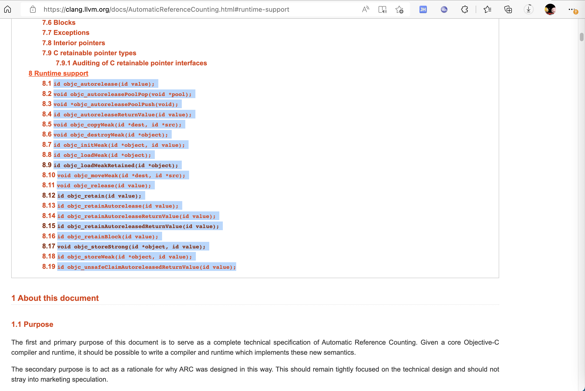

# objc系列函数

此处介绍iOS的ObjC的Runtime中，常见的，以`objc`开头的一些系列函数。

其中对应官网资料就是：

* [Objective-C Automatic Reference Counting (ARC) — Clang 15.0.0git documentation (llvm.org)](https://clang.llvm.org/docs/AutomaticReferenceCounting.html#arc-runtime-objc-retain)

对应的`objc`开头的系列函数是：

* id `objc_autorelease`(id value);
* void `objc_autoreleasePoolPop`(void *pool);
* void *`objc_autoreleasePoolPush`(void);
* id `objc_autoreleaseReturnValue`(id value);
* void `objc_copyWeak`(id *dest, id *src);
* void `objc_destroyWeak`(id *object);
* id `objc_initWeak`(id *object, id value);
* id `objc_loadWeak`(id *object);
* id `objc_loadWeakRetained`(id *object);
* void `objc_moveWeak`(id *dest, id *src);
* void `objc_release`(id value);
* id `objc_retain`(id value);
* id `objc_retainAutorelease`(id value);
* id `objc_retainAutoreleaseReturnValue`(id value);
* id `objc_retainAutoreleasedReturnValue`(id value);
* id `objc_retainBlock`(id value);
* void `objc_storeStrong`(id *object, id value);
* id `objc_storeWeak`(id *object, id value);
* id `objc_unsafeClaimAutoreleasedReturnValue`(id value);



下面详细介绍部分函数：

## objc_autoreleaseReturnValue

TODO：

* 【整理】iOS逆向心得：iOS函数objc_autoreleaseReturnValue
* 【已解决】iOS逆向Xcode调试：_objc_autoreleaseReturnValue继续运行导致后续release相关代码运行不到

## objc_alloc

`objc_alloc`是NSObject的类的分配空间，常和`objc_init`搭配使用

TODO：

【整理】iOS底层函数：objc_alloc

## objc_getClass

iOS逆向的动态调试时，底层写hook代码，往往会涉及到这个`objc_getClass`

* 底层写hook代码

举例：

```c
Class NSErrorClass = objc_getClass("NSError");
Class NSDictionaryClass = objc_getClass("NSDictionary");

// 写代码解析传入的变量，是什么类型，然后决定取出对应属性，即request url
//NSURL* getHamErrReqUrl(NSError* curError){
NSURL* getHamErrReqUrl(id erroOrDict){
    NSURL* curUrl = NULL;
//    if (curError) {
    if (erroOrDict) {
        NSDictionary* curUserInfo = NULL;
        if ([erroOrDict isKindOfClass: NSErrorClass]){
            curUserInfo = [erroOrDict userInfo];
        } else if ([erroOrDict isKindOfClass: NSDictionaryClass]) {
            curUserInfo = (NSDictionary*)erroOrDict;
        }

        if (curUserInfo) {
            id hamErrUrlReq = curUserInfo[@"HAMErrorURLRequest"];
            if (hamErrUrlReq != NULL) {
                BOOL isUrlReq = [hamErrUrlReq isKindOfClass: NSMutableURLRequestClass];
                if (isUrlReq) {
                    curUrl = [hamErrUrlReq URL];
                }
            }
        }
    }

    return curUrl;
}
```

TODO：

【无法解决】iOS越狱检测和反越狱检测：objc_getClass

【整理】iOS运行时Runtime：objc_getClass相关函数

## objc_storeStrong

定义：

```c
void objc_storeStrong(id *object, id value);
```

说明：

Precondition: object is a valid pointer to a __strong object which is adequately aligned for a pointer. value is null or a pointer to a valid object.

Performs the complete sequence for assigning to a __strong object of non-block type [*]. Equivalent to the following code:

内部实现逻辑：

```c
void objc_storeStrong(id *object, id value) {
  id oldValue = *object;
  value = [value retain];
  *object = value;
  [oldValue release];
}
```

* > This does not imply that a __strong object of block type is an invalid argument to this function. Rather it implies that an objc_retain and not an objc_retainBlock operation will be emitted if the argument is a block.

相关理解：

* 在`Objective-C`中，对象的引用关系由引用修饰符来决定，如`__strong`、`__weak`、`__autorelease`等等，编译器会根据不同的修饰符生成不同逻辑的代码来管理内存。
  * 在`MRC`时代`Retain`修饰符将会使被引用的对象引用计数`+1`
  * 在`ARC`中`__strong`修饰符作为其替代者

在正向开发写代码，在给`__strong`变量赋值时

```c
obj = otherObj;
```

内部其实会调用对应的`runtime`的函数：

```c
// 会变成如下函数调用
objc_storeStrong(&obj, otherObj);
```

## objc_enumerationMutation

iOS逆向期间，常会看到，伪代码中有个`objc_enumerationMutation`，其实就是表示：代码循环 而已

-》反推：正向代码中，用了`for`、`while`等循环的逻辑。

TODO：

【已解决】iOS底层函数：objc_enumerationMutation

## objc_retainBlock

`objc_retainBlock`是和ObjC中的`Block`相关的函数。和ARC中的引用计数中相关。

TODO：

【已解决】iOS基础知识：objc_retainBlock

## objc_loadWeakRetained

TODO：

【未解决】Xcode的lldb中objc_loadWeakRetained传入的对象是什么类

## objc_copyImageNames

TODO：

【无需解决】iOS越狱检测和反越狱检测：objc_copyImageNames
