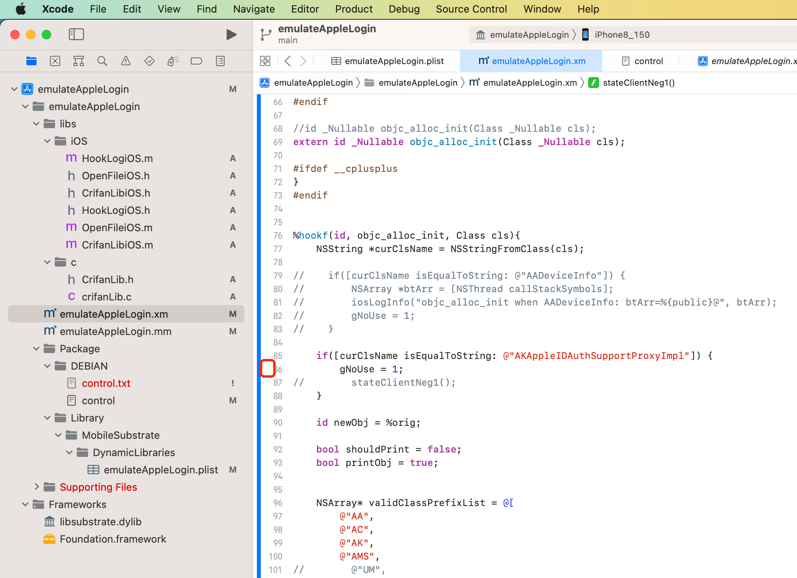

# NSStringFromClass

## 应用举例

### CDLCUnknown

* `Source/CDLoadCommand.m`

```objc
+ (id)loadCommandWithDataCursor:(CDMachOFileDataCursor *)cursor;
{
    Class targetClass = [CDLCUnknown class];

    //NSLog(@"targetClass: %@", NSStringFromClass(targetClass));
```

### AppDelegate

* `main.m`

```objc
#import <UIKit/UIKit.h>
#import "AppDelegate.h"
#import "CrifanLib.h"

int main(int argc, char * argv[]) {
    // anti-debug
    iOS_antiDebug_ptrace();

    NSString * appDelegateClassName;
    @autoreleasepool {
        // Setup code that might create autoreleased objects goes here.
        appDelegateClassName = NSStringFromClass([AppDelegate class]);
    }
    return UIApplicationMain(argc, argv, nil, appDelegateClassName);
}
```

### objc_alloc_init

```objc
%hookf(id, objc_alloc_init, Class cls){
    NSString *curClsName = NSStringFromClass(cls);

    if([curClsName isEqualToString: @"AKAppleIDAuthSupportProxyImpl"]) {
        gNoUse = 1;
        stateClientNeg1();
    }
```


