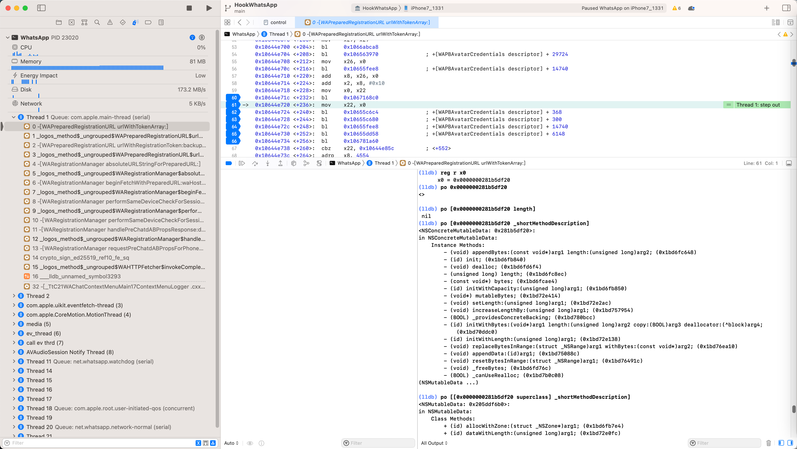
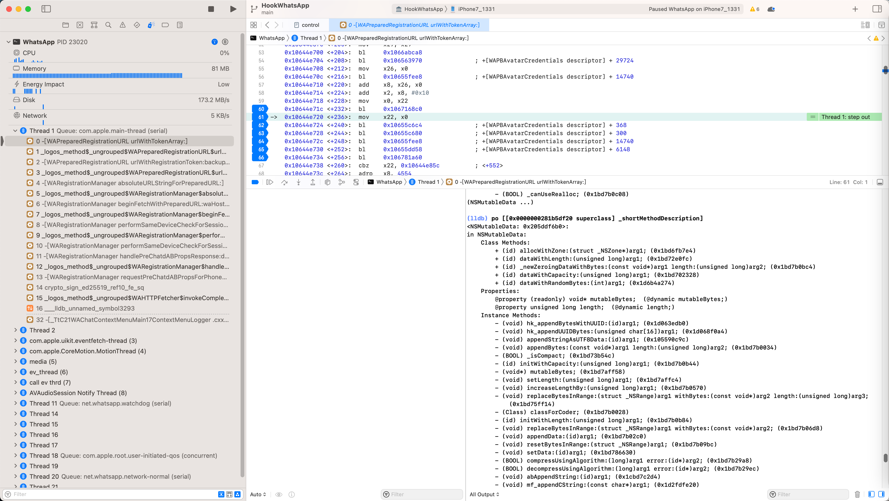

# superclass

## 应用举例

### NSConcreteMutableData

查看当前类NSConcreteMutableData：

```bash
(lldb) po [0x0000000281b5df20 _shortMethodDescription]
<NSConcreteMutableData: 0x281b5df20>:
in NSConcreteMutableData:
     Instance Methods:
         - (void) appendBytes:(const void*)arg1 length:(unsigned long)arg2; (0x1bd6fc648)
         - (id) init; (0x1bd6fb840)
         - (void) dealloc; (0x1bd6fd6f4)
         - (unsigned long) length; (0x1bd6fc8ec)
         - (const void*) bytes; (0x1bd6fcae4)
         - (id) initWithCapacity:(unsigned long)arg1; (0x1bd6fb850)
         - (void*) mutableBytes; (0x1bd72e414)
         - (void) setLength:(unsigned long)arg1; (0x1bd72e2ac)
         - (void) increaseLengthBy:(unsigned long)arg1; (0x1bd757954)
         - (BOOL) _providesConcreteBacking; (0x1bd780bcc)
         - (id) initWithBytes:(void*)arg1 length:(unsigned long)arg2 copy:(BOOL)arg3 deallocator:(^block)arg4; (0x1bd70ddc0)
         - (id) initWithLength:(unsigned long)arg1; (0x1bd72e138)
         - (void) replaceBytesInRange:(struct _NSRange)arg1 withBytes:(const void*)arg2; (0x1bd76ea10)
         - (void) appendData:(id)arg1; (0x1bd75088c)
         - (void) resetBytesInRange:(struct _NSRange)arg1; (0x1bd76491c)
         - (void) _freeBytes; (0x1bd6fd76c)
         - (BOOL) _canUseRealloc; (0x1bd7b0c08)
(NSMutableData ...)
```



的父类 == `NSMutableData` 的属性和函数：

```bash
(lldb) po [[0x0000000281b5df20 superclass] _shortMethodDescription]
<NSMutableData: 0x205ddf6b0>:
in NSMutableData:
     Class Methods:
         + (id) allocWithZone:(struct _NSZone*)arg1; (0x1bd6fb7e4)
         + (id) dataWithLength:(unsigned long)arg1; (0x1bd72e0fc)
         + (id) _newZeroingDataWithBytes:(const void*)arg1 length:(unsigned long)arg2; (0x1bd7b0bc4)
         + (id) dataWithCapacity:(unsigned long)arg1; (0x1bd702328)
         + (id) dataWithRandomBytes:(int)arg1; (0x1d6b4a274)
     Properties:
         @property (readonly) void* mutableBytes;  (@dynamic mutableBytes;)
         @property unsigned long length;  (@dynamic length;)
     Instance Methods:
         - (void) hk_appendBytesWithUUID:(id)arg1; (0x1d063edb0)
         - (void) hk_appendUUIDBytes:(unsigned char[16])arg1; (0x1d068f0a4)
         - (void) appendStringAsUTF8Data:(id)arg1; (0x105590c9c)
         - (void) appendBytes:(const void*)arg1 length:(unsigned long)arg2; (0x1bd7b0034)
         - (BOOL) _isCompact; (0x1bd73b54c)
         - (id) initWithCapacity:(unsigned long)arg1; (0x1bd7b0b44)
         - (void*) mutableBytes; (0x1bd7aff58)
         - (void) setLength:(unsigned long)arg1; (0x1bd7affc4)
         - (void) increaseLengthBy:(unsigned long)arg1; (0x1bd7b0570)
         - (void) replaceBytesInRange:(struct _NSRange)arg1 withBytes:(const void*)arg2 length:(unsigned long)arg3; (0x1bd75ff14)
         - (Class) classForCoder; (0x1bd7b0028)
         - (id) initWithLength:(unsigned long)arg1; (0x1bd7b0b84)
         - (void) replaceBytesInRange:(struct _NSRange)arg1 withBytes:(const void*)arg2; (0x1bd7b06d8)
         - (void) appendData:(id)arg1; (0x1bd7b02c0)
         - (void) resetBytesInRange:(struct _NSRange)arg1; (0x1bd7b09bc)
         - (void) setData:(id)arg1; (0x1bd786630)
         - (BOOL) compressUsingAlgorithm:(long)arg1 error:(id*)arg2; (0x1bd7b29a8)
         - (BOOL) decompressUsingAlgorithm:(long)arg1 error:(id*)arg2; (0x1bd7b29ec)
         - (void) abAppendString:(id)arg1; (0x1cbd7c2d4)
         - (void) mf_appendCString:(const char*)arg1; (0x1d2fdfe20)
         - (void) mf_makeImmutable; (0x1d2fe0044)
         - (void) mf_appendRFC2231CompliantValue:(id)arg1 forKey:(id)arg2; (0x1d2fcf6ec)
         - (void) mf_convertNetworkLineEndingsToUnix; (0x1d2fe0008)
         - (void) mf_convertNetworkLineEndingsToUnixInRange:(struct _NSRange)arg1; (0x1d2fdfe5c)
         - (void) replaceTrailingWith7LSB:(unsigned long)arg1; (0x1d6b424d4)
(NSData ...)
```


