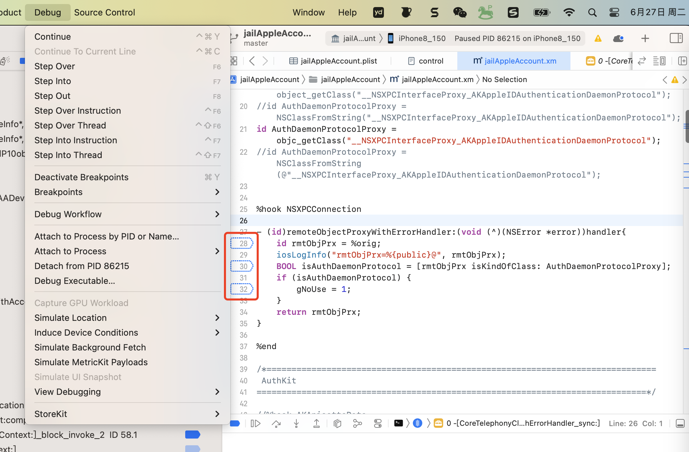
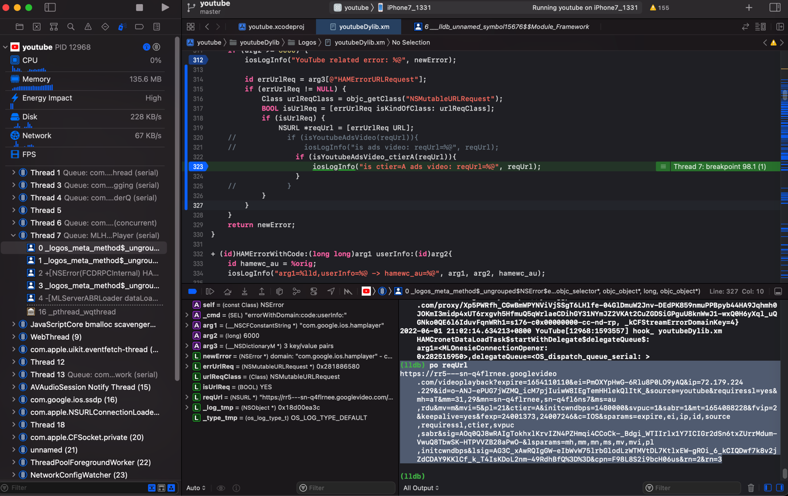
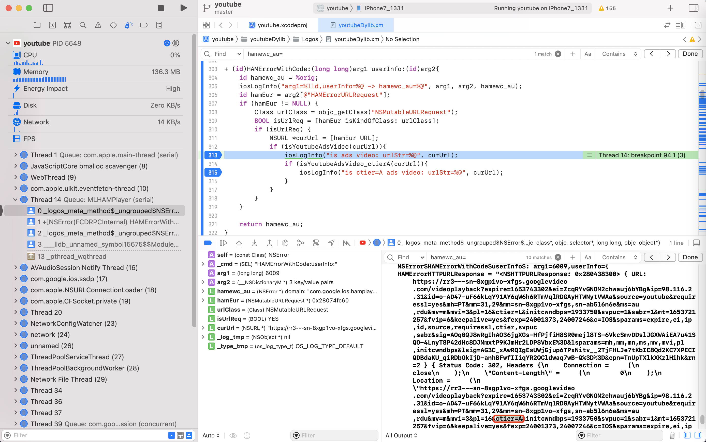

# isKindOfClass

## 应用举例

### AuthDaemonProtocolProxy

```objc
%hook NSXPCConnection

- (id)remoteObjectProxyWithErrorHandler:(void (^)(NSError *error))handler{
    id rmtObjPrx = %orig;
    iosLogInfo("rmtObjPrx=%{public}@", rmtObjPrx);
    BOOL isAuthDaemonProtocol = [rmtObjPrx isKindOfClass: AuthDaemonProtocolProxy];
    if (isAuthDaemonProtocol) {
        gNoUse = 1;
    }
    return rmtObjPrx;
}

%end
```



### NSHTTPURLResponse

```objc
- (void)_unsafe_provisionAnisetteWithCompletion:(void (^)(BOOL, NSError *))completion {
...
    [session beginDataTaskWithRequest:request completionHandler:^(NSData *data, NSHTTPURLResponse *response, NSError *error) {
...
            if (![response isKindOfClass:[NSHTTPURLResponse class]]) {
```

和：

```objc
static CFURLResponseRef createCFURLResponseFromResponseData(CFDataRef responseData)
{
...
    if (![response isKindOfClass:[NSHTTPURLResponse class]])
```

### _shortMethodDescription

```bash
(lldb) po [0x0000000120427c80 _shortMethodDescription]
<__NSCFLocalDataTask: 0x120427c80>:
in __NSCFLocalDataTask:
     Instance Methods:
         - (void) _onqueue_didReceiveResponse:(id)arg1 completion:(^block)arg2; (0x5c30dd01820f43dc)
         - (BOOL) isKindOfClass:(Class)arg1; (0xda4fcc81820974fc)
(__NSCFLocalSessionTask ...)
```

### NSURL

```bash
=========== [*] Detected call to: -[NSURL isKindOfClass:]
argSelStr:  isKindOfClass:
argCount:  1
```

和：

```bash
           /* TID 0x103 */
  5609 ms  -[NSURL _cfTypeID]
  5611 ms  -[NSURL path]
  5611 ms     | -[NSURL _cfurl]
  7203 ms  -[NSURL isEqual:0x2806e07e0]
  7203 ms     | -[NSURL isKindOfClass:0x1f2270158]
  7203 ms     | -[NSURL _cfurl]
  7203 ms     | -[NSURL _cfurl]
  7203 ms  -[NSURL _cfTypeID]
```

### YTAdBreakRendererFetcher

```objc
void __cdecl -[YTAdBreakRendererFetcher makeAdRequestWithAdBreak:contentPlayerResponse:responseBlock:playbackContext:clientPlaybackNonce:midrollIndex:liveTargetingParams:adBreakLength:autonavSettingState:currentMediaTime:retryEnabled:](YTAdBreakRendererFetcher *self, SEL a2, id a3, id a4, id a5, id a6, id a7, signed __int64 a8, id inputLiveTargetingParams, double inputBreakLength, int a11, double a12, bool retryEnabled)
{
...
  if ( objc_msgSend_3E84298(v21, "isKindOfClass:", v27) & 1 )
```

### NSError

```objc
id __cdecl +[NSError HAMErrorWithURLResponse:userInfo:request:](NSError_meta *self, SEL a2, id a3, id a4, id a5)
{
...
  if ( (unsigned int)objc_msgSend(v8, "isKindOfClass:", v16) )
```

### errorWithDomain

```objc
+ (id) errorWithDomain:(id)arg1 code:(long)arg2 userInfo:(id)arg3{
    id newError = %orig;
    iosLogInfo("errDomain=%@,code=%ld, userInfo=%@ -> newError=%@", arg1, arg2, arg3, newError);
    if (arg2 >= 6000) {
        iosLogInfo("YouTube related error: %@", newError);
        
        id errUrlReq = arg3[@"HAMErrorURLRequest"];
        if (errUrlReq != NULL) {
            Class urlReqClass = objc_getClass("NSMutableURLRequest");
            BOOL isUrlReq = [errUrlReq isKindOfClass: urlReqClass];
            if (isUrlReq) {
                NSURL *reqUrl = [errUrlReq URL];
    //            if (isYoutubeAdsVideo(reqUrl)){
    //                iosLogInfo("is ads video: reqUrl=%@", reqUrl);
                    if (isYoutubeAdsVideo_ctierA(reqUrl)){
                        iosLogInfo("is ctier=A ads video: reqUrl=%@", reqUrl);
                    }
    //            }
            }
        }
    }
    return newError;
}
```



### HAMErrorWithCode

```objc
+ (id)HAMErrorWithCode:(long long)arg1 userInfo:(id)arg2{
    id hamewc_au = %orig;
    iosLogInfo("arg1=%lld,userInfo=%@ -> hamewc_au=%@", arg1, arg2, hamewc_au);
    id hamEur = arg2[@"HAMErrorURLRequest"];
    if (hamEur != NULL) {
        Class urlClass = objc_getClass("NSMutableURLRequest");
        BOOL isUrlReq = [hamEur isKindOfClass: urlClass];
        if (isUrlReq) {
            NSURL *curUrl = [hamEur URL];
            if (isYoutubeAdsVideo(curUrl)){
                iosLogInfo("is ads video: urlStr=%@", curUrl);
                if (isYoutubeAdsVideo_ctierA(curUrl)){
                    iosLogInfo("is ctier=A ads video: urlStr=%@", curUrl);
                }
            }
        }
    }

    return hamewc_au;
}
```



### TTInstallUtil

```asm
__text:00000000092EC444 ; id __cdecl +[TTInstallUtil onTheFlyParameter](TTInstallUtil_meta *self, SEL)
__text:00000000092EC444 __TTInstallUtil_onTheFlyParameter_      ; DATA XREF: __objc_const:00000000005F3588↑o
...
__text:00000000092ECD30                 MOV             X2, X0
__text:00000000092ECD34                 ADRP            X8, #isKindOfClass_@PAGE
__text:00000000092ECD38                 LDR             X1, [X8,#isKindOfClass_@PAGEOFF] ; char *
```

### UIStatusBarDataNetworkItemView

```objc
-(void)networktype{
    NSArray *subviews = [[[[UIApplication sharedApplication] valueForKey:@"statusBar"] valueForKey:@"foregroundView"]subviews];
    NSNumber *dataNetworkItemView = nil;
    
    for (id subview in subviews) {
        if([subview isKindOfClass:[NSClassFromString(@"UIStatusBarDataNetworkItemView") class]]) {
            dataNetworkItemView = subview;
            break;
        }
    }
...
```

### AWEPremainDelayInitTask

```bash
(lldb) po [objc_getClass("AWEPremainDelayInitTask") _methodDescription]
<AWEPremainDelayInitTask: 0x103c80470>:
in AWEPremainDelayInitTask:
     Class Methods:
         + (void) stubForCheck; (0x110f957fc)
         + (void) execute; (0x1089c6910)
     Properties:
         @property (readonly) unsigned long hash;
         @property (readonly) Class superclass;
         @property (readonly, copy) NSString* description;
         @property (readonly, copy) NSString* debugDescription;
in NSObject:
     Class Methods:
         + (BOOL) bdp_swizzleClass:(Class)arg1 selector:(SEL)arg2 swizzledClass:(Class)arg3 swizzledSelector:(SEL)arg4; (0x1089af3f4)
...
         + (id) performSelector:(SEL)arg1 withObject:(id)arg2 withObject:(id)arg3; (0x1bda92b48)
         + (BOOL) isKindOfClass:(Class)arg1; (0x1bda75df8)
         + (BOOL) isMemberOfClass:(Class)arg1; (0x1bda92a74)
...
```

### UIStatusBar_Modern

```objc
    NSArray *infoArray = nil;
    id statusBar = [[UIApplication sharedApplication] valueForKey:@"statusBar"];
    if ([statusBar isKindOfClass:NSClassFromString(@"UIStatusBar_Modern")]) {
        infoArray = [[[statusBar valueForKey:@"statusBar"] valueForKey:@"foregroundView"] subviews];
    } else {
        infoArray = [[statusBar valueForKey:@"foregroundView"] subviews];
    }
```

### UIStatusBarServiceItemView

```objc
- (IBAction)statusCarrierBtnClicked:(UIButton *)sender {
    NSArray *infoArray = [[[[UIApplication sharedApplication] valueForKeyPath:@"statusBar"] valueForKeyPath:@"foregroundView"] subviews];

    NSString *serviceString = @"?";

    for (id info in infoArray)
    {
        if ([info isKindOfClass:NSClassFromString(@"UIStatusBarServiceItemView")])
        {
            serviceString = [info valueForKeyPath:@"serviceString"];
            NSLog(@"公司为：%@", serviceString);
        }
    }

    _statusServiceStrLbl.text = serviceString;
}
```

### XCUIApplication.class

```objc
+ (int)writeXmlWithRootElement:(id<FBElement>)root
                     indexPath:(nullable NSString *)indexPath
                  elementStore:(nullable NSMutableDictionary *)elementStore
            includedAttributes:(nullable NSSet<Class> *)includedAttributes
                        writer:(xmlTextWriterPtr)writer
{
...
  XCElementSnapshot *currentSnapshot;
  NSArray<XCElementSnapshot *> *children;
  if ([root isKindOfClass:XCUIElement.class]) {
    XCUIElement *element = (XCUIElement *)root;
    NSMutableArray<NSString *> *snapshotAttributes = [NSMutableArray array];
    if (nil != includedAttributes) {
      for (Class includedAttribute in includedAttributes) {
        [snapshotAttributes addObjectsFromArray:[includedAttribute performSelector:@selector(internalNames)]];
      }
      // Element types should always be there to build XML tree nodes
      // Duplicates in this array are OK, since insternally it is anyway
      // flattened to a set
      [snapshotAttributes addObject:FB_ElementTypeAttributeName];
    }
    if ([snapshotAttributes containsObject:FB_XCAXAIsVisibleAttributeName]
        || 0 == snapshotAttributes.count) {
      // If the app is not idle state while we retrieve the visiblity state
      // then the snapshot retrieval operation might freeze and time out
      [element.application fb_waitUntilSnapshotIsStable];
    }
    if ([root isKindOfClass:XCUIApplication.class]) {
      currentSnapshot = element.fb_cachedSnapshot ?: element.fb_lastSnapshot;
...
```

### FBClassNameToken.class

* `WebDriverAgent/WebDriverAgentLib/Utilities/FBClassChainQueryParser.m`

```objc
+ (nullable FBClassChain*)compiledQueryWithTokenizedQuery:(NSArray<FBBaseClassChainToken *> *)tokenizedQuery originalQuery:(NSString *)originalQuery error:(NSError **)error
{
...
  NSMutableArray<FBAbstractPredicateItem *> *predicates = [NSMutableArray array];
  for (FBBaseClassChainToken *token in tokenizedQuery) {
    if ([token isKindOfClass:FBClassNameToken.class]) {
      if (isTypeSet) {
        NSString *description = [NSString stringWithFormat:@"Unexpected token '%@'. The type name can be set only once.", token.asString];
        *error = [self.class compilationErrorWithQuery:originalQuery description:description];
        return nil;
      }
      @try {
        chainElementType = [FBElementTypeTransformer elementTypeWithTypeName:token.asString];
        isTypeSet = YES;
      } @catch (NSException *e) {
        if ([e.name isEqualToString:FBInvalidArgumentException]) {
          NSString *description = [NSString stringWithFormat:@"'%@' class name is unknown to WDA", token.asString];
          *error = [self.class compilationErrorWithQuery:originalQuery description:description];
          return nil;
        }
        @throw e;
      }
    } else if ([token isKindOfClass:FBStarToken.class]) {
      if (isTypeSet) {
        NSString *description = [NSString stringWithFormat:@"Unexpected token '%@'. The type name can be set only once.", token.asString];
        *error = [self.class compilationErrorWithQuery:originalQuery description:description];
        return nil;
      }
      chainElementType = XCUIElementTypeAny;
      isTypeSet = YES;
    } else if ([token isKindOfClass:FBDescendantMarkerToken.class]) {
      if (isDescendantSet) {
        NSString *description = [NSString stringWithFormat:@"Unexpected token '%@'. Descendant markers cannot be duplicated.", token.asString];
        *error = [self.class compilationErrorWithQuery:originalQuery description:description];
        return nil;
      }
      isTypeSet = NO;
      isPositionSet = NO;
      [predicates removeAllObjects];
      isDescendantSet = YES;
    } else if ([token isKindOfClass:FBAbstractPredicateToken.class]) {
      if (isPositionSet) {
...
```

### HAMCronetDataLoadTaskClass

```objc
%hook MLHAMDataLoadTaskObserverImpl

- (void)dataLoadTaskDidStart:(id)arg1{
    iosLogInfo("dataLoadTask=%@", arg1);
    
//    BOOL isCornetClass = [arg1 isKindOfClass: HAMCronetDataLoadTaskClass];
//    if (isCornetClass) {
...
```

### NSErrorClass

```objc
Class NSMutableURLRequestClass = objc_getClass("NSMutableURLRequest");
Class NSErrorClass = objc_getClass("NSError");
Class NSDictionaryClass = objc_getClass("NSDictionary");


//NSURL* getHamErrReqUrl(NSError* curError){
NSURL* getHamErrReqUrl(id erroOrDict){
    NSURL* curUrl = NULL;
//    if (curError) {
    if (erroOrDict) {
        NSDictionary* curUserInfo = NULL;
        if ([erroOrDict isKindOfClass: NSErrorClass]){
            curUserInfo = [erroOrDict userInfo];
        } else if ([erroOrDict isKindOfClass: NSDictionaryClass]) {
            curUserInfo = (NSDictionary*)erroOrDict;
        }
        
        if (curUserInfo) {
            id hamErrUrlReq = curUserInfo[@"HAMErrorURLRequest"];
            if (hamErrUrlReq != NULL) {
                BOOL isUrlReq = [hamErrUrlReq isKindOfClass: NSMutableURLRequestClass];
                if (isUrlReq) {
                    curUrl = [hamErrUrlReq URL];
                }
            }
        }
    }


    return curUrl;
}
```


### NSNull

```objc
- (id)cb_objectForKey:(id)aKey{
    id object = [self cb_objectForKey:aKey];
    if ([object isKindOfClass:[NSNull class]]) {
        return nil;
    }else{
        return object;
    }
}
```

### sub_69CDC88

```asm
__text:00000000069CDC88 sub_69CDC88
...
__text:00000000069CDD64                 MOV             X2, X0
__text:00000000069CDD68                 ADRP            X8, #isKindOfClass_@PAGE
__text:00000000069CDD6C                 LDR             X1, [X8,#isKindOfClass_@PAGEOFF] ; char *
```

### sub_100F6B4

```objc
__int64 __fastcall sub_100F6B4(__int64 result)
{
...
      if ( (unsigned int)objc_msgSend(v4, "isKindOfClass:", v5) )
```
